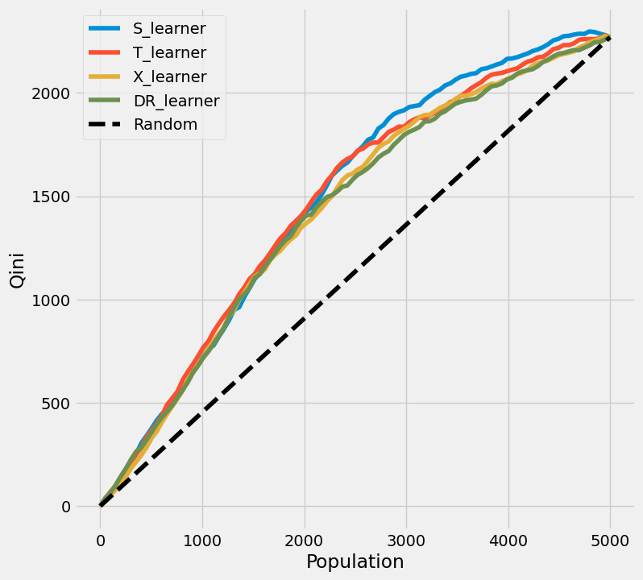

# Uplift Modeling: Comparing Meta-Learners for Treatment Targeting

Estimating **who** to target with an intervention (an email, a promotion, an ad)
so that a limited budget produces the largest incremental effect. This project
compares four causal meta-learners on their ability to rank individuals by their
individual treatment effect (CATE / uplift), and evaluates them with the Qini
curve — an evaluation that relies only on observed outcomes, not on the (in
practice unknowable) true treatment effect.

## Problem

Standard response models predict *who will convert*. But some of those people
would have converted anyway — targeting them wastes budget. The right question is
causal: **for whom does the treatment actually change behavior?** This is the
individual treatment effect, and ranking people by it is *uplift modeling*.

- **Outcome (Y):** the response we want to influence
- **Treatment (T):** whether the person received the intervention (1) or not (0)
- **Features (X):** covariates used to estimate how the effect varies by person

The deliverable is a ranking that answers: *if we can only treat a fraction of
the population, whom should we pick?*

## Approach

**Estimators compared** — four meta-learners, each estimating the Conditional
Average Treatment Effect (CATE):

| Learner | Idea |
|---|---|
| S-learner | One model with treatment as a feature; difference the prediction at T=1 vs T=0 |
| T-learner | Two separate models (treated, control); take their difference |
| X-learner | Improves T-learner by imputing counterfactuals across groups and combining with propensity weighting; more robust under group imbalance |
| DR-learner | Doubly robust: builds an AIPW-type pseudo-outcome from an outcome model and a propensity model; consistent if either model is correct |

**Honest evaluation** — every CATE estimate is produced **out-of-fold** via K-fold
cross-validation, so no individual is scored by a model that trained on them.
Models are compared with the **Qini curve** and the **Qini score**, which measure
how much better than random targeting each ranking is, using only observed Y and
T. The true CATE is never used for evaluation, mirroring what is possible with
real data.

## Results

All four learners were scored out-of-fold and ranked by Qini score (higher is
better; normalized so random targeting ≈ 0).

| Learner | Qini score |
|---|---|
| **S-learner** | **0.154** |
| T-learner | 0.147 |
| X-learner | 0.130 |
| DR-learner | 0.129 |

**Best learner: S-learner**, with a Qini score of **0.154** — its ranking
captures meaningfully more incremental effect than random targeting. Notably, the
simplest learner won: on this data the more elaborate X- and DR-learners did not
improve on the basic S- and T-learners. This is a useful reminder that estimator
complexity should be validated empirically rather than assumed — the extra
machinery in X-/DR-learners pays off mainly under conditions (e.g. treatment-group
imbalance, misspecified outcome models) that this dataset does not stress.



*Qini curves for all four learners against the random baseline. Curves above the
diagonal indicate a ranking better than random targeting.*

## Repository structure

```
uplift-modeling-project/
├── README.md
├── requirements.txt
├── qini_curves.png                     # Qini evaluation plot
└── uplift_meta_learner_comparison.py   # end-to-end pipeline
```

## How to run

```bash
pip install -r requirements.txt
python uplift_meta_learner_comparison.py
```

Or open the code in Google Colab, install the requirements in the first cell,
and run top to bottom.

## Method notes

- **Why out-of-fold?** Evaluating a model on the same data it trained on inflates
  performance. K-fold cross-validation gives each person a score from a model
  that did not see them — the same principle as cross-fitting in the causal
  inference literature.
- **Why Qini, not error against the true effect?** In any real application the
  true individual treatment effect is unobservable (each person is only ever
  treated or not). The Qini curve evaluates a ranking using only observed
  outcomes, so the workflow transfers directly to real data.
- **Qini score caveat.** On randomized data the naive difference-in-means used by
  the Qini curve is unbiased. On observational data it is confounded and should
  be replaced by an IPW/AIPW-adjusted estimate; this is a known limitation of the
  naive Qini curve.

## Possible extensions

- Swap the synthetic data for a real randomized dataset (e.g. Criteo, Hillstrom,
  Lenta) — the pipeline is data-agnostic.
- Add AIPW-adjusted Qini for observational data.
- Bootstrap the Qini score for confidence intervals.
- Add model interpretability (which features drive high uplift).
